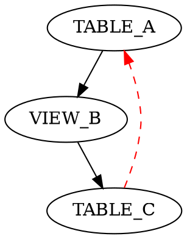

# Tool: build_dependency_graph

## Purpose

Builds a visual dependency graph showing relationships between Snowflake objects, useful for understanding data flow and identifying circular dependencies.

## Parameters

| Parameter | Type | Required | Description |
|-----------|------|----------|-------------|
| `database` | string | Yes | Database name to analyze |
| `output_dir` | string | No | Output directory for graph files (default: "./dependencies") |
| `format` | string | No | Output format: "dot", "json", or "both" (default: "both") |
| `include_views` | boolean | No | Include views in dependency graph (default: true) |
| `include_functions` | boolean | No | Include functions in dependency graph (default: false) |
| `max_depth` | integer | No | Maximum dependency depth to analyze (default: 5) |

## Returns

Returns a dictionary containing:
- `output_dir`: Directory where graph files were saved
- `files_created`: List of files created
- `summary`: Summary statistics of the dependency graph
- `circular_dependencies`: List of detected circular dependencies
- `total_objects`: Total number of objects analyzed

## Examples

### Basic Dependency Graph
```json
{
  "tool": "build_dependency_graph",
  "arguments": {
    "database": "MY_DATABASE"
  }
}
```

**Expected Output**:
```json
{
  "output_dir": "./dependencies",
  "files_created": [
    "dependency_graph.dot",
    "dependency_graph.json"
  ],
  "summary": {
    "total_objects": 25,
    "relationships": 45,
    "circular_dependencies": 2
  },
  "circular_dependencies": [
    {
      "cycle": ["TABLE_A", "VIEW_B", "TABLE_C", "TABLE_A"],
      "severity": "high"
    }
  ],
  "total_objects": 25
}
```

### DOT Format Only
```json
{
  "tool": "build_dependency_graph",
  "arguments": {
    "database": "MY_DATABASE",
    "format": "dot",
    "output_dir": "./graphs"
  }
}
```

### Exclude Views
```json
{
  "tool": "build_dependency_graph",
  "arguments": {
    "database": "MY_DATABASE",
    "include_views": false,
    "max_depth": 3
  }
}
```

## Common Use Cases

### Architecture Documentation
Generate visual diagrams of your data architecture for documentation.

### Circular Dependency Detection
Identify problematic circular dependencies that can cause issues.

### Impact Analysis
Understand the scope of changes by visualizing dependencies.

### Data Lineage Visualization
Create visual representations of data flow through your system.

## Troubleshooting

### Database Not Found
**Error**: `Database 'MY_DATABASE' not found`
**Solution**:
- Verify database name spelling
- Check database exists in Snowflake
- Ensure proper permissions

### No Dependencies Found
**Error**: `No dependencies found`
**Solution**:
- Check if objects have relationships
- Verify include_views/include_functions settings
- Increase max_depth if needed

### Performance Issues
**Error**: `Query timeout`
**Solution**:
- Reduce max_depth
- Exclude views or functions
- Use smaller database subset

### Output Directory Issues
**Error**: `Cannot write to output directory`
**Solution**:
- Check directory permissions
- Ensure directory exists
- Use absolute path if needed

## Related Tools

- [build_catalog](build_catalog.md) - Build catalog before dependency analysis
- [query_lineage](query_lineage.md) - Analyze specific object lineage
- [get_catalog_summary](get_catalog_summary.md) - Check catalog status
- [preview_table](preview_table.md) - Preview table structure

## Output Files

### DOT File
Graphviz format for visualization:


### JSON File
Structured dependency data:
```json
{
  "nodes": [
    {"id": "TABLE_A", "type": "table"},
    {"id": "VIEW_B", "type": "view"}
  ],
  "edges": [
    {"from": "TABLE_A", "to": "VIEW_B", "type": "dependency"}
  ]
}
```

## Notes

- Requires a built catalog for analysis
- DOT files can be rendered with Graphviz
- Circular dependencies are highlighted in red
- Performance scales with database size and complexity
- Output files are overwritten on each run
