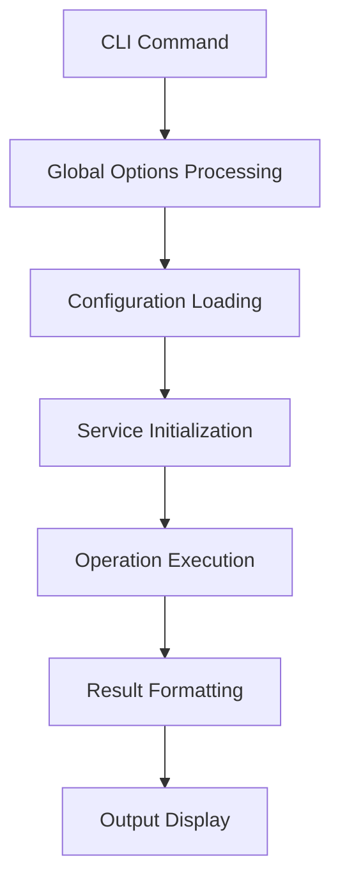
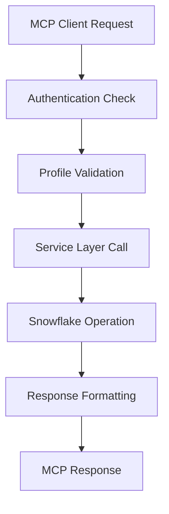
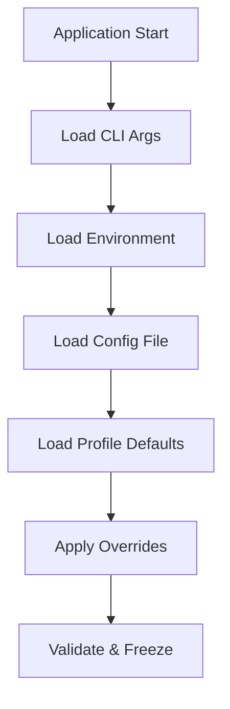

# SnowCLI Tools Architecture (v1.9.0)

> **Overview**: SnowCLI Tools uses a layered service architecture that provides both direct CLI access and AI assistant integration through MCP (Model Context Protocol).

## Architectural Principles

### 1. Layered Architecture
```
┌─────────────────────────────────────────────────────────────┐
│                  Client Applications                        │
│              (AI Assistants, CLI Users)                     │
├─────────────────────────────────────────────────────────────┤
│                  Presentation Layer                         │
│                 (CLI Commands, MCP Server)                  │
├─────────────────────────────────────────────────────────────┤
│                   Service Layer                             │
│           (CatalogService, QueryService, etc.)             │
├─────────────────────────────────────────────────────────────┤
│                Infrastructure Layer                         │
│        (Snowflake Labs MCP, Snow CLI, Configuration)       │
├─────────────────────────────────────────────────────────────┤
│                  Snowflake Platform                         │
└─────────────────────────────────────────────────────────────┘
```

### 2. Separation of Concerns
- **Business Logic**: Isolated in service layer
- **Infrastructure**: Handled by Snowflake Labs MCP
- **Configuration**: Centralized and immutable
- **Error Handling**: Consistent across all layers

### 3. Dependency Injection
- Services receive dependencies through constructor injection
- Configuration is provided at service initialization
- No global state or singletons in business logic

## Core Components

### Service Layer (`src/nanuk_mcp/service_layer/`)

The service layer provides the core business logic for SnowCLI Tools operations:

```python
# Service interfaces are clean and focused
class CatalogService:
    def __init__(self, *, config: Config | None = None)
    def build_catalog(self, database: str = None, schema: str = None) -> dict
    def load_summary(self, catalog_dir: str) -> dict

class QueryService:
    def __init__(self, *, config: Config | None = None)
    def execute_with_service(self, service, statement: str, **context) -> dict
    def session_from_mapping(self, overrides: dict) -> SessionContext

class DependencyService:
    def __init__(self, *, config: Config | None = None)
    def build_dependency_graph(self, **filters) -> dict
```

**Design Patterns**:
- **Dependency Injection**: All services receive configuration through constructor
- **Strategy Pattern**: Different execution strategies for sync/async operations
- **Factory Pattern**: Session context creation from various inputs

### MCP Integration (`src/nanuk_mcp/mcp_server.py`)

The MCP server provides AI assistant integration through a layered approach:

```python
# Layered MCP Architecture
┌─────────────────────────────────────┐
│     SnowCLI Tools MCP Layer         │
│  • catalog, lineage, dependencies   │
│  • Enhanced query tools             │
│  • Custom diagnostics               │
├─────────────────────────────────────┤
│    Snowflake Labs MCP Layer         │
│  • Authentication & security        │
│  • Core Snowflake operations        │
│  • Connection management            │
└─────────────────────────────────────┘
```

**Key Features**:
- **Health Monitoring**: Comprehensive health checks and diagnostics
- **Error Handling**: Structured error responses with context
- **Resource Management**: Efficient resource lifecycle management
- **Profile Validation**: Enhanced Snowflake profile validation

### Configuration Management (`src/nanuk_mcp/config.py`)

Centralized configuration with override precedence:

```python
# Configuration Hierarchy (highest to lowest precedence)
1. CLI Arguments        (--warehouse COMPUTE_WH)
2. Environment Variables (SNOWFLAKE_WAREHOUSE=COMPUTE_WH)
3. Configuration File   (config.yml: warehouse: COMPUTE_WH)
4. Profile Defaults     (Snow CLI profile settings)
5. System Defaults      (Built-in fallbacks)
```

**Features**:
- **Immutable**: Configuration objects cannot be modified after creation
- **Thread-safe**: Safe for concurrent access
- **Validated**: All values are validated at load time
- **Extensible**: Easy to add new configuration options

### CLI Interface (`src/nanuk_mcp/cli.py`)

Command-line interface with consistent patterns:

```bash
# Global options available to all commands
nanuk -p <profile> -c <config> <command> [options]

# Command groups with focused responsibilities
nanuk catalog      # Data discovery operations
nanuk lineage      # Lineage analysis
nanuk depgraph     # Dependency mapping
nanuk query        # SQL execution
nanuk mcp          # MCP server for AI assistants
```

## Data Flow

### 1. CLI Command Execution


### 2. MCP Request Processing


### 3. Configuration Resolution


## Error Handling Strategy

### Error Categories
```python
# Hierarchical error classification
SnowCLIError
├── ProfileValidationError    # Profile/auth issues
├── ConfigurationError        # Config problems
├── ConnectionError          # Network/connectivity
├── PermissionError          # Access denied
└── OperationError           # Business logic failures
```

### Error Response Pattern
```python
# Consistent error response structure
{
    "success": false,
    "error": "Human-readable error message",
    "error_type": "ProfileValidationError",
    "context": {
        "profile": "my-profile",
        "operation": "catalog_build",
        "timestamp": "2024-01-01T12:00:00Z"
    },
    "recommendations": [
        "Check profile exists: snow connection list",
        "Verify credentials are valid"
    ]
}
```

## Security Considerations

### 1. Authentication
- **No Credential Storage**: Relies entirely on Snow CLI profiles
- **External Authentication**: Supports key-pair, OAuth, SSO
- **Profile Isolation**: Each operation uses specified profile only

### 2. Data Access
- **Principle of Least Privilege**: Only requests necessary permissions
- **Profile-scoped**: All operations scoped to profile's access
- **No Data Persistence**: No local data caching by default

### 3. MCP Security
- **Local Communication**: MCP server runs locally only
- **No Network Exposure**: Default stdio transport
- **Profile Validation**: Validates profile before any operations

## Performance Characteristics

### 1. Service Layer
- **Stateless**: Services can be created/destroyed efficiently
- **Connection Pooling**: Leverages Snowflake Labs MCP connection management
- **Lazy Loading**: Services initialized only when needed

### 2. MCP Server
- **Event-driven**: Responds to requests without polling
- **Resource Efficient**: Minimal memory footprint
- **Connection Reuse**: Efficient connection management

### 3. Configuration
- **Load Once**: Configuration loaded once at startup
- **Immutable**: No runtime configuration changes
- **Fast Access**: O(1) configuration value lookup

## Extension Points

### 1. New Services
```python
# Add new service to service layer
class AnalyticsService:
    def __init__(self, *, config: Config | None = None):
        self._config = config or get_config()

    def generate_insights(self) -> dict:
        # Business logic here
        pass
```

### 2. New MCP Tools
```python
# Add new MCP tool
@server.tool(name="analytics_insights")
async def analytics_insights_tool() -> Dict[str, Any]:
    analytics_service = AnalyticsService(config=config)
    return await anyio.to_thread.run_sync(
        analytics_service.generate_insights
    )
```

### 3. New CLI Commands
```python
# Add new CLI command group
@cli.group()
def analytics():
    """Analytics and insights commands."""
    pass

@analytics.command()
def insights():
    """Generate data insights."""
    service = AnalyticsService()
    result = service.generate_insights()
    console.print_json(result)
```

## Testing Strategy

### 1. Unit Tests
- **Service Layer**: Mock external dependencies
- **Configuration**: Test all override scenarios
- **Error Handling**: Verify error propagation

### 2. Integration Tests
- **MCP Server**: Test with real Snowflake connections
- **CLI Commands**: End-to-end command testing
- **Profile Validation**: Test with various profile types

### 3. Contract Tests
- **Service Interfaces**: Verify API contracts
- **MCP Protocol**: Ensure MCP compliance
- **Configuration Schema**: Validate config structure

## Migration Guide (1.4.x → 1.9.0)

### Breaking Changes
- **Service Layer**: New service-based architecture
- **Configuration**: Enhanced configuration management
- **MCP Integration**: New layered MCP approach

### Migration Steps
1. **Update Dependencies**: Install new MCP packages
2. **Update Profiles**: Ensure Snow CLI profiles are valid
3. **Update Integration**: MCP clients may need reconfiguration
4. **Test Thoroughly**: Run verification test suite

### Compatibility
- **CLI Commands**: Fully backward compatible
- **Configuration**: Existing configs supported with deprecation warnings
- **Profiles**: All existing Snow CLI profiles supported

---

*Architecture Version: 1.9.0 | Last Updated: 2025-09-28*