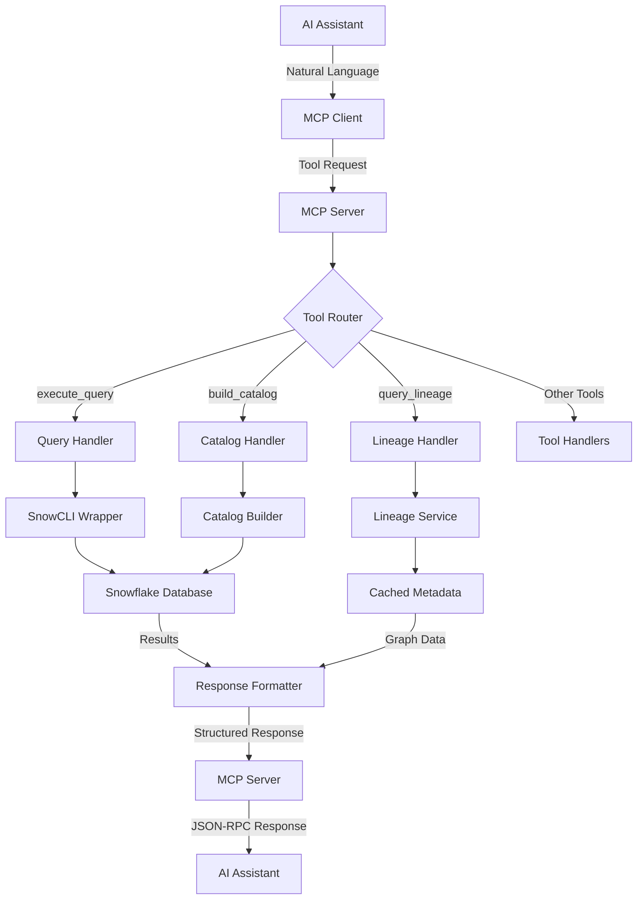

# MCP Server Architecture Documentation

## Overview

The MCP (Model Context Protocol) server in snowcli-tools provides a structured interface between AI assistants and Snowflake databases. This document details the complete architecture, data flow, and implementation patterns.

## System Components

### 1. Protocol Layer

The MCP server implements the Model Context Protocol specification, which defines:
- **Transport**: stdio (standard input/output) for process communication
- **Encoding**: JSON-RPC 2.0 for message format
- **Schema**: Strongly-typed tool definitions with input/output contracts

### 2. Server Implementation

```
src/snowcli_tools/mcp_server.py
├── SnowflakeMCPServer (Main Class)
│   ├── __init__()           # Initialize server, CLI wrapper, config
│   ├── run()                # Async server lifecycle
│   ├── handle_list_tools()  # Tool discovery endpoint
│   ├── handle_call_tool()   # Tool execution dispatcher
│   └── Tool Methods:
│       ├── _execute_query()
│       ├── _preview_table()
│       ├── _build_catalog()
│       ├── _query_lineage()
│       ├── _build_dependency_graph()
│       ├── _test_connection()
│       └── _get_catalog_summary()
```

### 3. Integration Points

The MCP server integrates with multiple snowcli-tools components:

```
MCP Server
    │
    ├─→ SnowCLI         (SQL execution via snow CLI wrapper)
    ├─→ Catalog Builder (Metadata extraction and cataloging)
    ├─→ Lineage Service (Data lineage analysis)
    ├─→ Dependency Graph (Object relationship mapping)
    └─→ Config Manager  (Profile and connection management)
```

## Data Flow Architecture

### Request Processing Pipeline



### Tool Execution Flow

Each tool follows this execution pattern:

1. **Request Validation**
   - Parse tool arguments
   - Validate required parameters
   - Apply default values

2. **Context Setup**
   - Override warehouse/database/schema/role if provided
   - Use profile defaults otherwise

3. **Operation Execution**
   - Call underlying snowcli-tools function
   - Handle errors gracefully

4. **Response Formatting**
   - Convert results to JSON/text
   - Include metadata and statistics
   - Format for AI consumption

## Tool Architecture

### Tool Definition Structure

```python
types.Tool(
    name="tool_name",
    description="Human-readable description",
    inputSchema={
        "type": "object",
        "properties": {
            "param1": {
                "type": "string",
                "description": "Parameter description"
            },
            "param2": {
                "type": "integer",
                "description": "Optional parameter",
                "default": 100
            }
        },
        "required": ["param1"]
    }
)
```

### Tool Categories

#### 1. Query Tools
- **execute_query**: Direct SQL execution
- **preview_table**: Table sampling

```
Input → SQL Generation → Execution → Result Formatting
```

#### 2. Catalog Tools
- **build_catalog**: Metadata extraction
- **get_catalog_summary**: Statistics retrieval

```
Input → Scope Definition → Parallel Extraction → JSON Output
```

#### 3. Analysis Tools
- **query_lineage**: Dependency tracing
- **build_dependency_graph**: Relationship mapping

```
Input → Graph Building → Traversal → Visualization
```

#### 4. Utility Tools
- **test_connection**: Connectivity verification

```
Input → Connection Test → Status Response
```

## Concurrency Model

The MCP server uses Python's asyncio for concurrent operations:

```python
async def run(self):
    async with mcp.server.stdio.stdio_server() as (read_stream, write_stream):
        await self.server.run(
            read_stream,
            write_stream,
            InitializationOptions(...)
        )
```

### Parallel Operations

Catalog building and dependency graph generation use thread pools:

```python
# Catalog builder uses concurrent.futures
with ThreadPoolExecutor(max_workers=concurrency) as executor:
    futures = [executor.submit(fetch_metadata, obj) for obj in objects]
    results = [f.result() for f in as_completed(futures)]
```

## Security Architecture

### Authentication Flow

```
AI Assistant → MCP Server → snowcli-tools → Snowflake CLI → Snowflake
                                                    ↓
                                          Profile Authentication
                                          (Key-pair/SSO/OAuth)
```

### Security Principles

1. **No Credential Storage**: MCP server never stores credentials
2. **Profile-Based Auth**: Leverages existing snow CLI profiles
3. **Role-Based Access**: Respects Snowflake RBAC
4. **Input Validation**: All tool inputs are validated
5. **Parameterized Queries**: Prevents SQL injection

## Error Handling

### Error Hierarchy

```
MCP Protocol Errors
    ├── Tool Not Found
    ├── Invalid Parameters
    └── Schema Validation

Application Errors
    ├── SnowCLI Errors
    │   ├── Connection Failed
    │   ├── Query Execution Error
    │   └── Permission Denied
    ├── Catalog Errors
    │   ├── Metadata Access
    │   └── File I/O
    └── Lineage Errors
        ├── Object Not Found
        └── Graph Build Failed
```

### Error Response Format

```json
{
    "error": {
        "code": -32603,
        "message": "Tool execution failed",
        "data": {
            "tool": "execute_query",
            "details": "Connection failed: Invalid credentials"
        }
    }
}
```

## Performance Considerations

### Optimization Strategies

1. **Connection Pooling**: Reuse snow CLI connections
2. **Metadata Caching**: Cache catalog and lineage data
3. **Parallel Execution**: Concurrent metadata fetching
4. **Result Streaming**: Stream large results
5. **Query Optimization**: Use efficient SQL patterns

### Resource Management

```python
# Example: Catalog building with controlled concurrency
MAX_DDL_CONCURRENCY = 8     # DDL fetching threads
CATALOG_CONCURRENCY = 16    # Metadata fetching threads
BATCH_SIZE = 1000           # Objects per batch
```

## Deployment Architecture

### Installation Modes

```
Base Installation (Core CLI only)
    pip install snowcli-tools

Full Installation (With MCP)
    pip install snowcli-tools[mcp]

Development Installation
    uv sync --dev
    uv add --extra mcp
```

### Runtime Dependencies

```
snowcli-tools[mcp]
    ├── snowflake-cli (>= 2.0.0)    # Official CLI
    ├── mcp (>= 1.0.0)               # Protocol implementation
    ├── sqlglot (>= 27.16.3)         # SQL parsing
    ├── pyvis (>= 0.3.2)             # Graph visualization
    └── Standard Library
        ├── asyncio                  # Async operations
        ├── json                     # Data serialization
        └── concurrent.futures       # Parallel execution
```

## Extension Points

### Adding New Tools

1. **Define Tool Schema** in `handle_list_tools()`
2. **Add Handler Case** in `handle_call_tool()`
3. **Implement Method** as `_tool_name()`
4. **Add Tests** in `test_mcp_server.py`
5. **Update Documentation**

### Custom Tool Example

```python
# 1. Define tool
types.Tool(
    name="analyze_performance",
    description="Analyze query performance",
    inputSchema={...}
)

# 2. Add handler
elif name == "analyze_performance":
    result = self._analyze_performance(**arguments)
    return [types.TextContent(type="text", text=result)]

# 3. Implement method
def _analyze_performance(self, query: str) -> str:
    # Implementation
    return analysis_results
```

## Monitoring and Debugging

### Logging Levels

```bash
# Enable debug logging
export SNOWCLI_TOOLS_DEBUG=1

# MCP protocol logging
export MCP_DEBUG=1
```

### Diagnostic Tools

1. **Connection Test**: `test_connection` tool
2. **Catalog Summary**: `get_catalog_summary` tool
3. **Direct Query**: `execute_query` for debugging
4. **Log Analysis**: Check stdio output

## Future Architecture Considerations

### Planned Enhancements

1. **WebSocket Transport**: Real-time bidirectional communication
2. **Multi-Account Support**: Manage multiple Snowflake accounts
3. **Query History**: Track and replay queries
4. **Smart Caching**: Intelligent metadata caching
5. **Plugin System**: Extensible tool architecture

### Scalability Roadmap

```
Current: Single Process, stdio
    ↓
Phase 1: Connection Pooling
    ↓
Phase 2: Distributed Caching
    ↓
Phase 3: Microservice Architecture
```

## References

- [MCP Specification](https://modelcontextprotocol.io/specification)
- [Snowflake CLI Documentation](https://docs.snowflake.com/en/user-guide/snowcli)
- [JSON-RPC 2.0 Specification](https://www.jsonrpc.org/specification)
- [snowcli-tools Repository](https://github.com/Evan-Kim2028/snowcli-tools)
